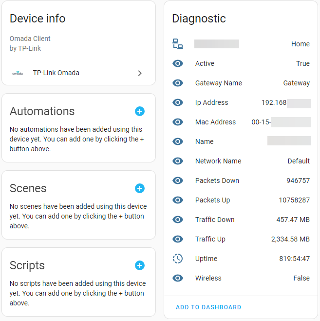
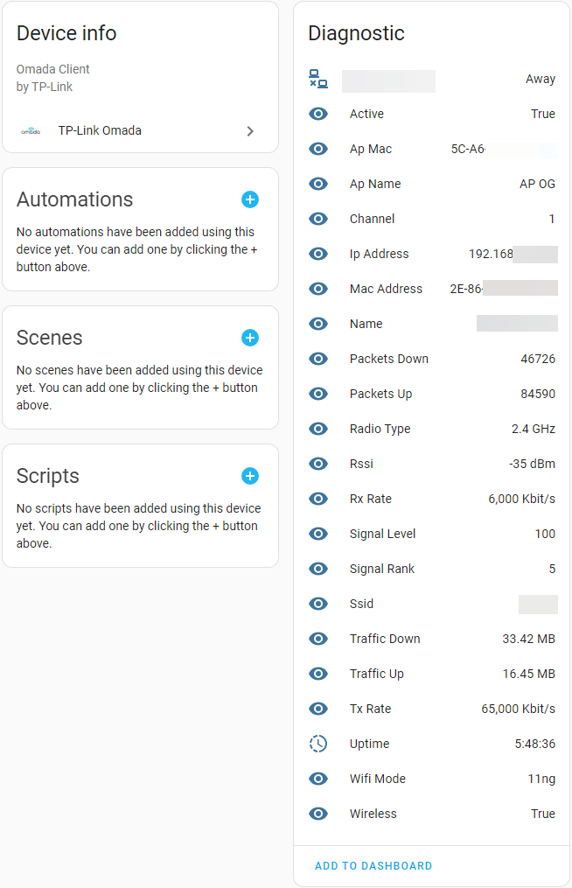
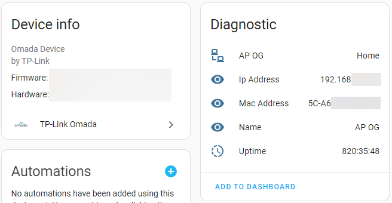
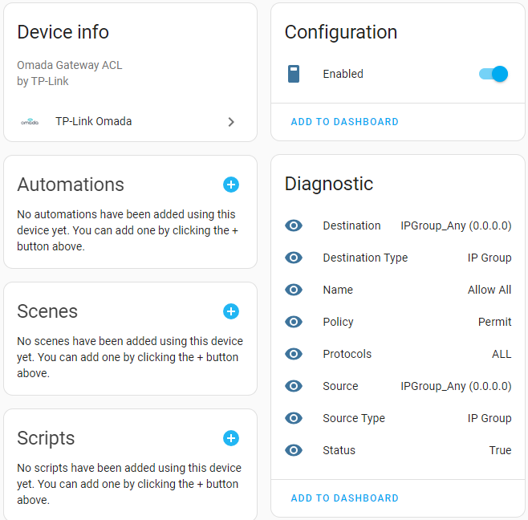

# Examples

this integration will display a lot of sensors for the following types:

## Client

### Wired

### Wireless

## Device

## ACL Rules

there are multiple types of ACL rules:

- Gateway
- Switch
- EAP

all types of ACL rules have a "Enabled" switch, were you can enable and disable the rule:

## URL Filterings

there are multiple types of URL Filtering rules:

- Gateway
- EAP

all types of URL Filtering rules have a "Enabled" switch, were you can enable and disable the rule:

